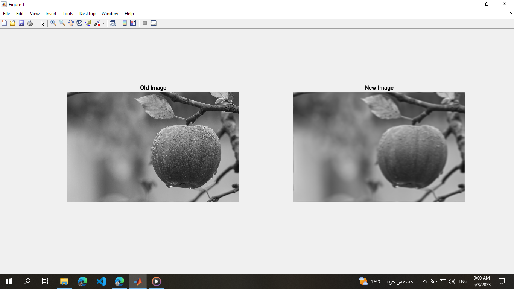
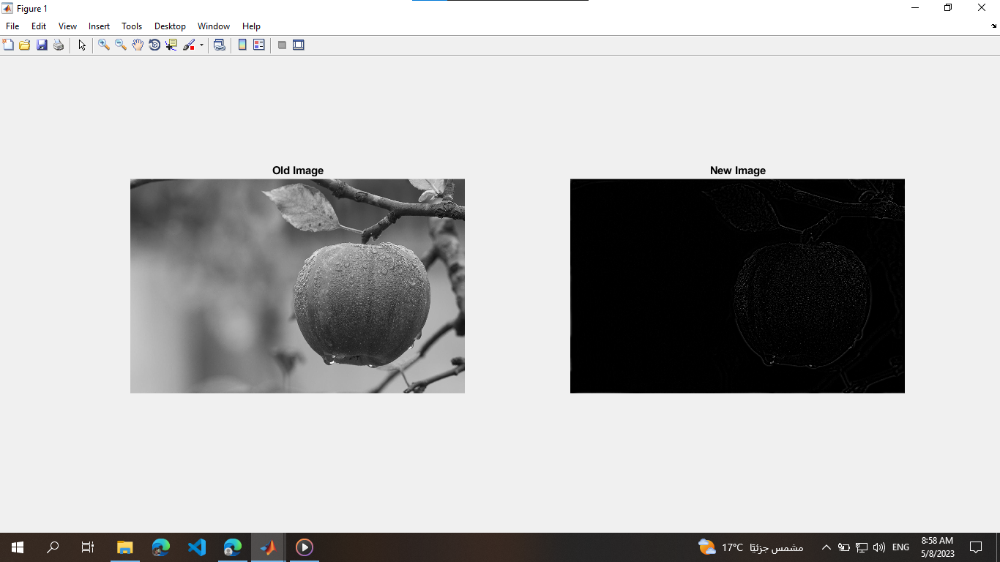
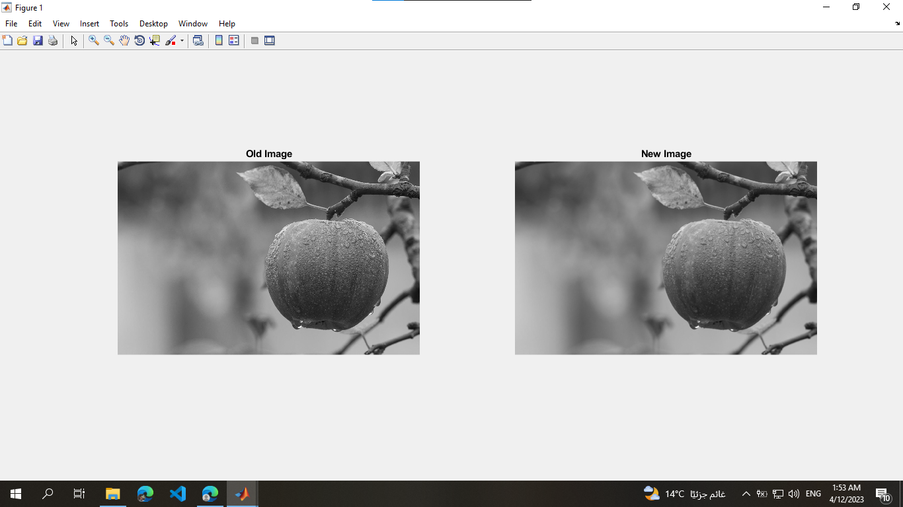
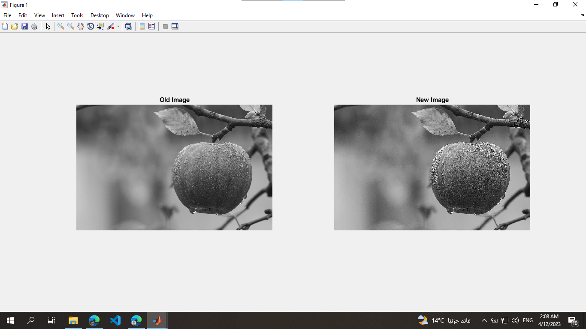
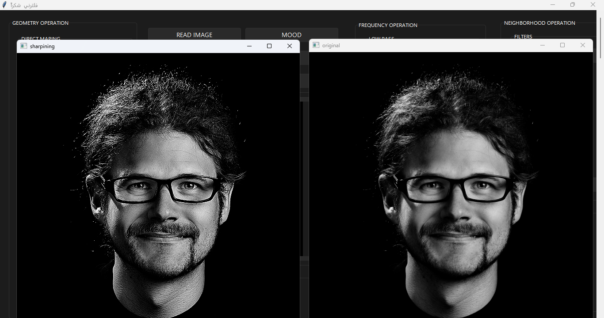
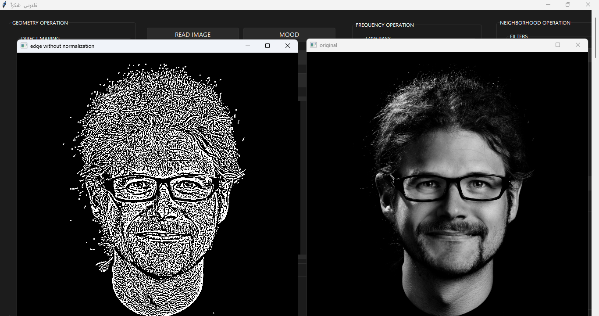

# Image Processing Algorithms with MATLAB & Python

A complete collection of academic-level image processing algorithms implemented using **MATLAB scripts** and **Python**, with a fully working GUI app for live testing and visualization.

---

## 📂 Project Structure

```
geometry-operations/        # Mapping & transformations (scaling, rotation)
pixel-operations/           # Brightness, contrast, grayscale, histogram, etc.
neighbor-operations/        # Filters, edge detection, smoothing & sharpening
simple-photoshop/           # Python GUI app with live filter testing
output/                     # Sample outputs (before/after images)
use-case-images/            # Test images to try out the algorithms
requirements.txt            # Python dependencies for GUI
```

---

## 💻 How to Run

### 🧠 MATLAB Scripts

- Open any `.m` file inside MATLAB and run directly.

### 🖼️ Python GUI App

```bash
pip install -r requirements.txt
python simple-photoshop/GUI.py
```

> No config needed. You can load an image and apply filters directly.

---

## 🔧 Requirements

All required libraries are in `requirements.txt`:

- `opencv-python`
- `numpy`
- `pillow`
- `matplotlib`
- `scikit-image`
- `sv-ttk` (for a better themed GUI)

Install them using:

```bash
pip install -r requirements.txt
```

---

## 📸 Sample Outputs

| Original | After Filter |
|----------|--------------|
|  |  |
|  |  |
|  |  |

---

## 🙌 Credits

- **Algorithms:** Implemented by Ziad Gamal (@ZiadGamalDev)
- **GUI App:** Built with the help of a teammate (frontend contribution)

---

## 🎓 Academic Context

This was my project for the **Image Processing** subject in faculty. It’s now public for others to **learn**, **reuse**, or get inspired.

> Built with ❤️ for knowledge sharing and portfolio building.
